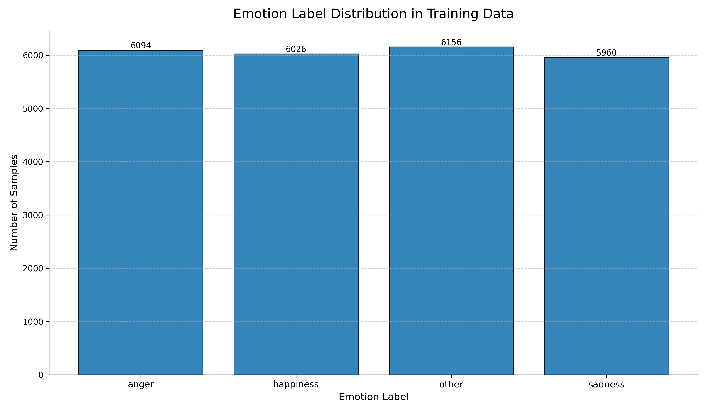

# Emo-Q-metric
Repository for emotion quality (EmoQ) detection model used in TTS generated speech assessment.

### Emotion Training dataset stats
| Emotion    | Count |
|:-----------|------:|
| other      | 6156  |
| anger      | 6094  |
| happiness  | 6026  |
| sadness    | 5960  |

# Model inference

- Download weights from Huggingface: https://huggingface.co/asya-ai/Emo-Q-Wav2vec2
- 
