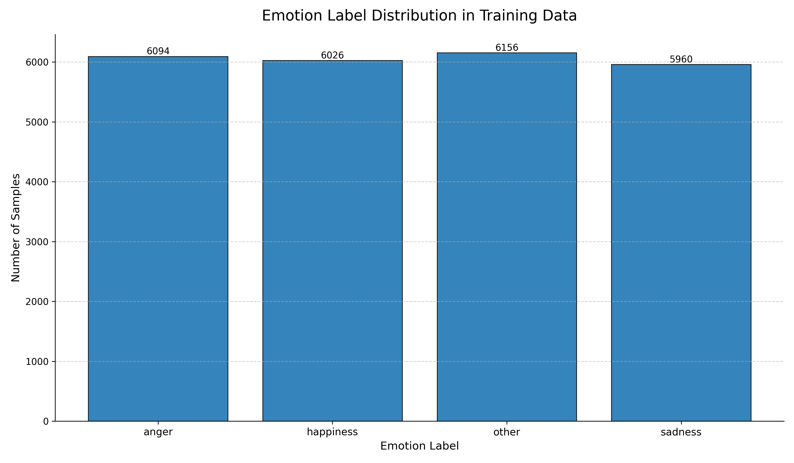

# Emo-Q-metric
Repository for emotion quality (EmoQ) detection model used in TTS generated speech assessment.

### Emotion Training dataset stats
| Emotion    | Count |
|:-----------|------:|
| other      | 6156  |
| anger      | 6094  |
| happiness  | 6026  |
| sadness    | 5960  |

Model was trained in binary emotion classifier format to detect with confidence value if the speech sample contains emotional content or not.
Data was structured in 2 classes [happiness, anger, sadness] vs [other] -> **emotion** | **no_emotion** classes

# Model inference

- Weights are automatically downloaded from Huggingface: https://huggingface.co/asya-ai/Emo-Q-Wav2vec2

# Metrics

- GenMOS: script is availablein the `metrics` folder, it is used to calculate the GenMOS score for the generated speech samples.
    - Pass a path to the generated speech directory containing .wav files and metadata.csv file with minimal columns [file_name, transcription]
    - Output will be a .csv (metadata_gmos) file with GenMOS scores for each sample in the input directory.

- EmoQ: script is ./inference.py
- NISQA: script is available in the `metrics` folder, it is used to calculate the NISQA score for the generated speech samples.